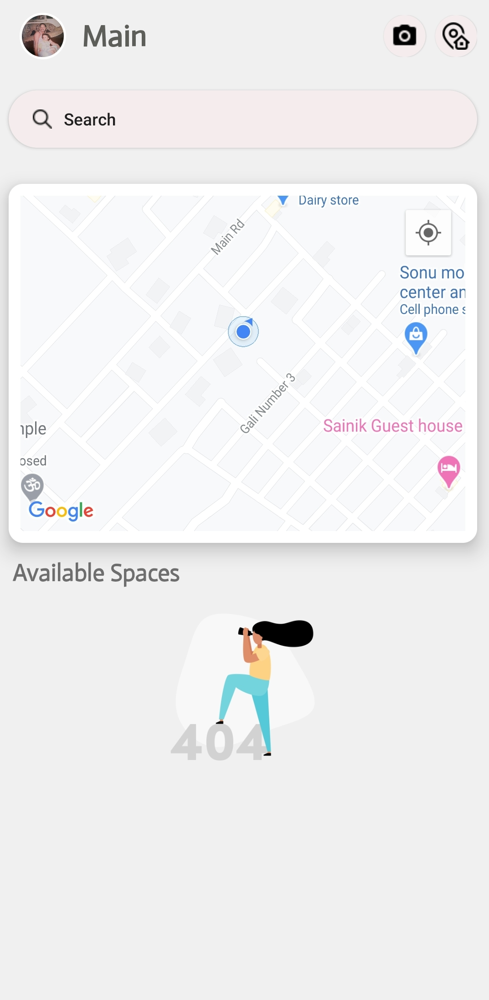
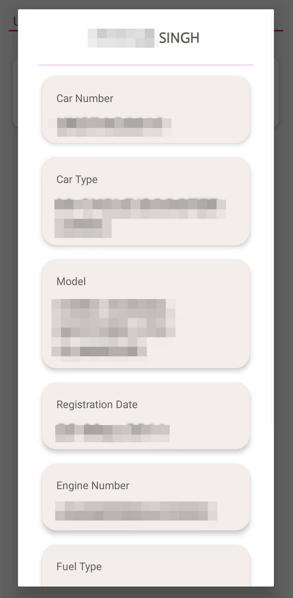
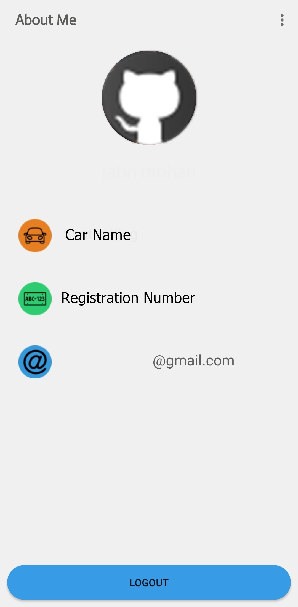

# iPark

    

iPark will let you find the details of an Indian Vehicle and find the nearby parking slots available to your location. You can easily find it by writing the registration number of by scaning the number plate
 Details include:
* Owner Name
* Vehicle Number
* Vehicle Type
* Vehicle Model
* Registration Date
* Insurance Date
* Engine Number
* Chassis Number
* Fuel Type

# Features
* Find nearby Parking Easily with location API
* Find the details of an Vehicle
* Contact the Vehicle Owner (IF THE OWNER IS REGISTERED IN APP via Email)
* Scan number plate using OCR
* Get nearby location details shown on Map
* Signup Using Google account

# Libraries 
* [Jsoup Library for Website Crawling](https://github.com/jhy/jsoup/)
* [Android SQLite](https://github.com/sqlite/sqlite)
* [Material Dialog Box](https://github.com/afollestad/material-dialogs)
* [Icon8 icons](https://icons8.com/)
* [Illustrations](https://illlustrations.co/)

### <b>Note:</b> This application is just for study purpose only
